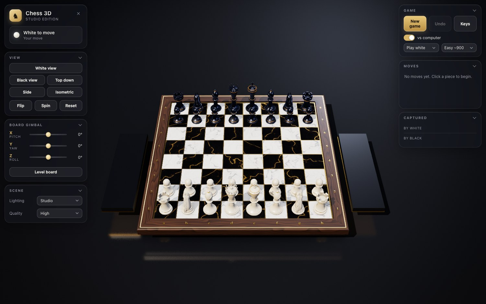
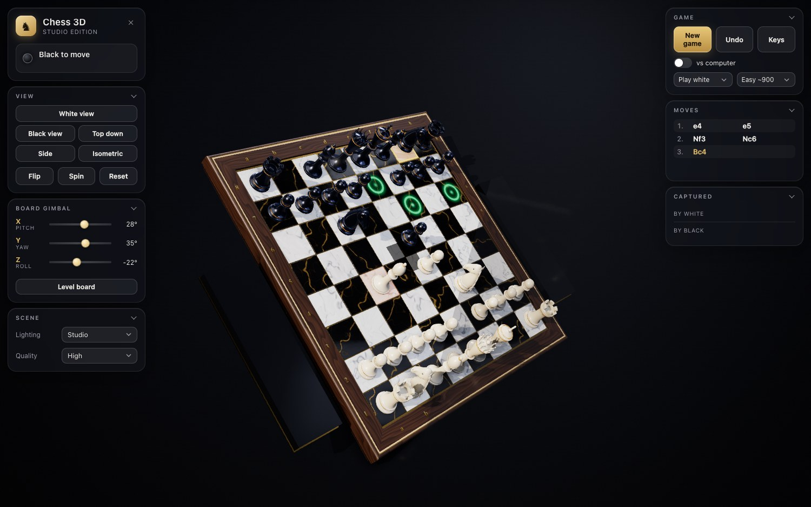
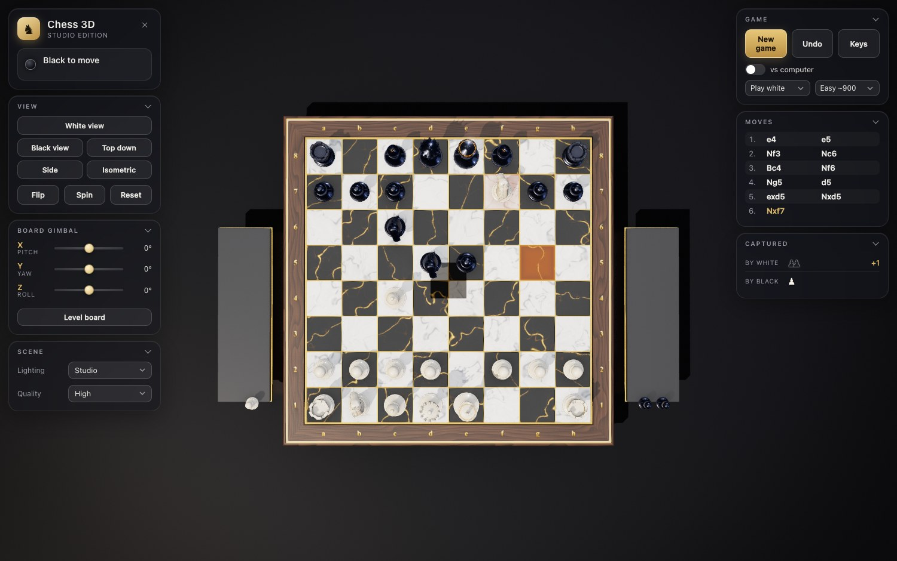

# Chess 3D

A 3D chessboard for the browser. A marble and walnut board with a gold inlay, sculpted Staunton pieces, studio lighting you can switch, and a board you can turn on all three axes. You play a full game of chess against the computer (you start as white on Easy), or switch the computer off and share the screen with another person.

Built with three.js (0.186) and Vite. Everything is procedural: the geometry comes from code, the textures from canvas, and the game loads no image, model or font files (the screenshots in `docs/` are only for this page).

**Play it:** https://bop-del.github.io/chess-3d/

## Controls

Mouse

| Action | Input |
|---|---|
| Select a piece, then move it | Left click the piece, then a highlighted square. Click another own piece to switch, click elsewhere to deselect |
| Orbit the camera | Drag |
| Rotate the board (gimbal X and Y) | Shift + drag, Ctrl + drag, or right drag |
| Zoom | Mouse wheel |
| Reset one gimbal slider to 0 | Double click the slider |

Keyboard

| Key | Action |
|---|---|
| Q / E | Board roll (gimbal Z) |
| W / S | Board pitch (gimbal X) |
| A / D | Board yaw (gimbal Y) |
| Arrow keys | Orbit the camera |
| + / - | Zoom |
| 1 | White view |
| 2 | Black view |
| 3 | Top down |
| 4 | Side |
| 5 | Isometric |
| V | Top down |
| F | Flip to the other side of the board |
| R | Reset the view |
| Space | Auto spin on and off |
| U | Undo |
| N | New game |
| H | Hide and show the HUD |
| ? or / | Keyboard shortcut sheet |
| Esc | Close the sheet, the game over banner or the promotion chooser |

Sliders and buttons (left panel)

| Control | What it does |
|---|---|
| View presets | White view, Black view, Top down, Side, Isometric. Smooth animated transitions |
| Flip, Spin, Reset | Turn to the other side, toggle auto spin, return to the start view |
| Board gimbal X, Y, Z | Three sliders from -180 to 180 degrees with a numeric readout, and a Level board button |
| Lighting | Studio, Gallery, Sunset, Night |
| Quality | Low, Medium, High |
| New game, Undo, Keys | Game buttons (right panel) |
| vs computer | On by default (you play white, Easy). Switch, your side (play white or black) and strength (Easy about 900, Normal about 1200, Hard about 1450, estimated, see below) |

Touch: a one finger drag orbits the camera, a tap selects and moves, a two finger pinch zooms. The sliders rotate the board. The panels collapse on narrow screens and a Controls button opens the left panel.

## Features

Rules

- Complete rules: castling (both sides, with the usual conditions), en passant, promotion with a chooser for queen, rook, bishop or knight, check, checkmate and stalemate
- Draws by the fifty-move rule, threefold repetition and insufficient material
- Move list in standard algebraic notation (SAN), captured pieces with the material balance, undo for any number of moves
- Play against the computer at three levels (Easy about 900, Normal about 1200, Hard about 1450 estimated Elo), as white or black. The computer opponent is on by default, you play white on Easy. Switch it off in the Game panel (or open `?ai=0`) for two players on one screen
- The rules engine is checked against the standard perft node counts

Rendering

- Board of white and black marble squares in a walnut frame with a gold inlay, coordinate labels, a plinth and a captured-piece tray on each side of the board
- Sculpted Staunton pieces: a lathe turned pawn, rook, bishop, queen and king and a modelled knight head. 58k to 83k triangles per piece type
- Four studio lighting presets: Studio, Gallery, Sunset and Night, with a smooth transition between them
- Quality tiers Low, Medium and High that change the shadow map size (1024, 2048 or 4096), the pixel ratio cap and the post chain
- Shadows, bloom, ambient occlusion (High tier), a vignette and grade pass, and a soft reflection of the pieces in the studio floor
- Board gimbal on X, Y and Z, independent of the camera orbit. The floor fades out when the board is tilted far from level

Limits: there is no network play. Two people share one screen (computer off), or you play the computer.

Browser support: needs WebGL 2. The build targets Safari 15 and later, and current Chrome, Edge and Firefox. It was tested in Chrome only. If the script cannot start (an old browser, a failed download), the loading screen says so after 20 seconds instead of waiting forever.

## URL parameters

All optional. They are meant for screenshots and tests, but work for anyone.

| Parameter | Value | Effect |
|---|---|---|
| `quality` | `low`, `medium`, `high` | Start in this quality tier (default `high`) |
| `light` | `Studio`, `Gallery`, `Sunset`, `Night` | Start with this lighting preset |
| `preset` | `White view`, `Black view`, `Top down`, `Side`, `Isometric` | Jump to a view preset |
| `yaw`, `pitch` | degrees | Set the camera angles |
| `dist` | number | Set the camera distance |
| `gx`, `gy`, `gz` | degrees | Set the board gimbal on X, Y, Z |
| `fen` | FEN string | Load a position |
| `moves` | `e2e4,e7e5,g1f3` | Play these moves after `fen` (the start position if there is none). Comma separated, from and to square, with a fifth letter for a promotion such as `e7e8q` |
| `select` | square, for example `e2` | Select the piece on this square |
| `promo` | four letters, for example `a7a8` | Click this move, which opens the promotion chooser |
| `ai` | `0`, `2`, `3`, `4` | The computer opponent is on by default (plays black, Easy). `ai=0` turns it off for two players, `ai=3` is Normal, `ai=4` is Hard |
| `spin` | `1` | Start with auto spin on |
| `hud` | `0` | Start with the HUD hidden |
| `help` | `1` | Open the keyboard shortcut sheet |
| `manual` | `1` | No render loop. Tests step time with `__chess.step(seconds)` and draw with `__chess.draw()` |

Example: `?ai=0&preset=Isometric&light=Sunset&moves=e2e4,e7e5,g1f3,b8c6`

## Development

Requires Node 20 or newer.

    npm install
    npm run dev        # http://localhost:5173
    npm run build      # production bundle in dist/
    npm run preview    # serve dist/ on http://localhost:4173

The build uses relative asset paths (`base: './'`), so `dist/` can be hosted from any folder or sub path.

Tests come in three tiers:

    node test/run.mjs            # fast, no browser: rules perft, piece geometry contract, text lint (this is npm test)
    node test/run.mjs smoke      # smoke, about a minute: build, serve, drive the real page in headless Chrome
    node tools/release-check.mjs # release: fresh build, page load, hostile URLs, docs and repo hygiene

The smoke tier plays a scripted game with real pointer clicks (capture, castling, en passant, promotion, a mate, undo, the computer reply), moves each gimbal slider, checks the render budgets and checks the canvas pixels in every view preset. The browser tiers use puppeteer-core with a locally installed Google Chrome, which renders with a software GL in headless mode. For that reason there are no golden image comparisons: the pixels differ between machines. Look at the screenshots instead.

`node tools/audit-plan.mjs` lists which of these checks a change needs, from the files changed since the last release.

A GitHub Actions workflow (`.github/workflows/pages.yml`) runs the fast test tier, then builds the site and deploys it to GitHub Pages on every push to `main`. If a test fails, nothing is deployed.

The module layout and the APIs between modules are in [docs/ARCHITECTURE.md](docs/ARCHITECTURE.md).

## Known issues

- The marble and walnut textures are 1024 px, so extreme close-ups look soft.
- The knight faces the opponent, so its mane shows from the white side and its nose extends past the base circle.
- The bishop slit has slightly sawtooth edges at extreme close-up.
- Frame rate on real GPUs is unmeasured beyond the author's machine. Tested mainly on software and Apple silicon GPUs. Two finger pinch zoom is untested.
- A fallback timer is used in background tabs, so loading is slower there.

## Licence

MIT, see [LICENSE](LICENSE). Uses [three.js](https://threejs.org/), also MIT, copyright the three.js authors.

## Computer strength

The ratings shown next to the levels are estimates. Each level was played for 30 games against Stockfish 19 limited to its lowest rating setting (UCI_Elo 1320, 60 ms per move), alternating colours from random openings: Easy scored 2.5/30, Normal 9.5/30 and Hard 20/30, which puts them at roughly 900, 1200 and 1450 on that scale. The error is about 100 points either way, and Stockfish's rating scale is not the same as online or club ratings, so read them as a guide to the ordering and spacing of the levels rather than a rating you would hold on a chess site. Playing against each other the gaps are wider: Hard beat Normal 27 games to 0 with 3 draws.
